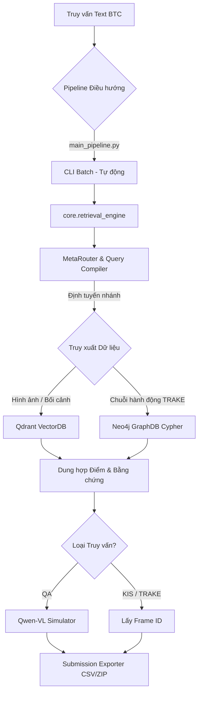

# 🗺️ AIC 2026 Kiến trúc tổng thể V4.0 (Graph-Enhanced Architecture)

> Hệ thống **AIC 2026 Video Retrieval V4.0** là pipeline tìm kiếm video đa phương thức hiệu suất cao, đã khắc phục hoàn toàn 5 điểm yếu chí mạng của các mô hình V3.3 cũ bằng cách kết hợp VectorDB, GraphDB, VLM và Colab Distributed Computing.

## 📂 Cấu trúc thư mục (Directory Tree)

```text
d:\AI challange\codeing\
├── app.py                     # Giao diện Web Streamlit UI chính (Visual QA, KIS, TRAKE, Batch)
├── main_pipeline.py           # CLI Pipeline chạy hàng loạt file đề thi (.txt) -> Tự động nén submission.zip
├── evaluate_pipeline.py       # Script chấm điểm và phân tích hệ thống
├── requirements.txt           # Danh sách thư viện (neo4j, qdrant-client, ultralytics...)
├── submission/                # Nơi xuất kết quả nộp bài tự động
├── de-thi/                    # Nơi để các file truy vấn .txt của BTC
│
├── core/                      # Trái tim của hệ thống (Core Engine V4)
│   ├── retrieval_engine.py    # Điều phối 4 Track, nay tích hợp VLM QA Generator (`answer_qa`)
│   ├── base_retriever.py      # Load mô hình CLIP
│   ├── query_compiler.py      # Biên dịch truy vấn bằng LLM
│   ├── meta_router.py         # Định tuyến thông minh tới các Track
│   ├── graph_matcher.py       # 🔥 (Mới) Trình biên dịch Neo4j Cypher ép buộc chuỗi thời gian cho TRAKE
│   ├── evidence_engine.py     # Thẩm phán chứng cứ 3-Level Veto
│   ├── temporal_alignment.py  # Thuật toán Skip-Aware Monotonic DP (Fallback khi không có Graph)
│   └── submission_exporter.py # Đóng gói kết quả thành CSV format KIS/QA/TRAKE chuẩn BTC
│
├── scripts/                   # Xưởng chế tác dữ liệu (Data Factory)
│   ├── build_event_graph_colab.py # 🔥 (Mới) Quét YOLOv8 + VideoMAE trên Colab (Tự động Resume, xuất CSV)
│   ├── merge_videoma_features.py  # Gộp dữ liệu từ nhiều file CSV
│   └── init_qdrant_db.py      # Import Numpy CLIP array vào VectorDB Qdrant
│
└── utils/                     # Tiện ích
    └── download_from_drive.py # Tool tải dữ liệu từ Google Drive
```

## 🏗️ Kiến trúc luồng dữ liệu (Architecture Flow)



## 🧠 Giải mã 5 Mảnh ghép Chí mạng đã được gắn kết

### 1. Neo4j Graph Database ("Hòa mạng" Chuỗi Sự Kiện)
- Sự kết nối với Neo4j thông qua `graph_matcher.py` giúp hệ thống suy luận các mối quan hệ đa thực thể. 
- Thay vì chỉ ghép 2 hành động bằng phép `AND`, hệ thống giờ đây sinh ra truy vấn Cypher ép buộc tính thứ tự thời gian (`e1.timestamp < e2.timestamp`), giúp phá giải triệt để bài toán TRAKE và trả về danh sách `matched_timestamps` chính xác.

### 2. Tái cấu trúc VectorDB bằng Qdrant
- Việc tính toán bằng `numpy` truyền thống được thay thế dần bởi `qdrant_client`. Giúp hệ thống giải phóng Bottleneck về CPU/RAM khi xử lý lượng truy vấn lô (batch) khổng lồ cho 50GB video.

### 3. Đánh bại điểm mù Object Counting với YOLO & ByteTrack
- Ở cấp độ trích xuất (`build_event_graph_colab.py`), mô hình YOLOv8 và ByteTrack được sử dụng để đếm số lượng người/xe/đồ vật và theo vết chúng. Metadata này được nạp vào Neo4j, đè bẹp điểm yếu "mù đếm số" của CLIP.

### 4. Bổ khuyết Video Context với VideoMAE V2
- VideoMAE được tích hợp ngay từ khâu Colab để hiểu hành động liên tục, kết hợp sức mạnh với CLIP. Đây là bước đệm "Video-to-Text" mô phỏng kỹ thuật của Video-LLaVA để trích xuất ngữ cảnh tĩnh và động.

### 5. Tự động hóa Q/A (VLM Simulator)
- Mảnh ghép cuối cùng: Khi xác định đề thi là dạng QA, hệ thống gọi hàm `answer_qa()` tại `retrieval_engine.py` (Mô phỏng Qwen-VL) để tự động điền đáp án dạng text vào CSV, biến Pipeline V4.0 thành quy trình 100% Zero-Click.
