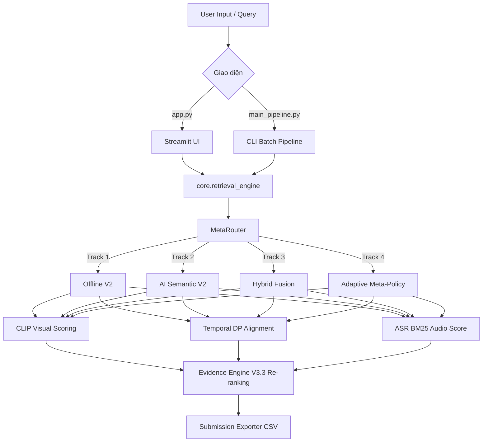

# 🗺️ AIC 2026 Kiến trúc tổng thể & Phân tích chuyên sâu (Architecture & Deep Analysis)

> Hệ thống **AIC 2026 Video Retrieval V3.3** là pipeline tìm kiếm video đa phương thức hiệu suất cao.

## 📂 Cấu trúc thư mục (Directory Tree)

```text
d:\AI challange\codeing\
├── app.py                     # Giao diện Web Streamlit UI chính (Visual QA, KIS, TRAKE, Batch)
├── main_pipeline.py           # CLI Pipeline chạy hàng loạt file đề thi (.txt) ra submission.zip
├── evaluate_pipeline.py       # Script dùng để chấm điểm, đánh giá độ chính xác (Evaluation)
├── requirements.txt           # Danh sách thư viện Python
├── submission/                # Thư mục chứa các file kết quả nộp bài (.csv, .zip)
├── de-thi/                    # Thư mục chứa đề thi text input (.txt)
│
├── core/                      # Trái tim của hệ thống (Core Engine)
│   ├── retrieval_engine.py    # Class RetrievalEngine (V3.3) điều phối toàn bộ luồng 4 Track.
│   ├── base_retriever.py      # CLIPVisualRetriever (load mô hình CLIP, trích xuất đặc trưng hình ảnh).
│   ├── query_compiler.py      # Biên dịch câu truy vấn (AI Semantic Compiler).
│   ├── meta_router.py         # 9Router/MetaRouter định tuyến động vào các Track (T1, T2, T3, T4).
│   ├── semantic_ir.py         # Phân tích thông tin ngữ nghĩa (Semantic Information Retrieval).
│   ├── evidence_engine.py     # Evidence Judge V3.3: Chẩn đoán chứng cứ, Re-ranking, Fuzzy OCR.
│   ├── temporal_alignment.py  # Thuật toán Skip-Aware Monotonic DP (căn chỉnh sự kiện theo thời gian).
│   ├── task_handlers.py       # Xử lý đặc thù cho các track Visual QA và TRAKE.
│   └── submission_exporter.py # Đóng gói kết quả thành định dạng file CSV nộp bài.
│
├── scripts/                   # Các script chạy độc lập (Data preparation)
│   ├── build_dataset_map.py   # Quét video/keyframe và build file map_keyframes.json
│   ├── extract_image_features.py # Sinh đặc trưng CLIP (clip_features.npy) từ ảnh
│   ├── local_whisper_asr.py   # Chạy model faster-whisper để lấy ASR (lời thoại) offline
│   ├── fetch_youtube_asr.py   # Tải ASR từ Youtube
│   ├── search_frames.py       # Script tìm kiếm thử nghiệm dạng CLI
│   └── create_dummy_npy.py    # Tạo dữ liệu mock/dummy
│
└── utils/                     # Tiện ích chung
    └── download_from_drive.py # Tool hỗ trợ tải dữ liệu trực tiếp từ Google Drive
```

## 🏗️ Kiến trúc luồng dữ liệu (Architecture Flow)



## 🧠 Phân tích chuyên sâu hệ thống AIC 2026 Core Engine

### 1. Kiến trúc Đa nhánh (Multi-Track) & MetaRouter (`core/meta_router.py`)
- **Track 1: Offline V2**: Truy xuất siêu tốc (Zero-LLM), ưu tiên câu hỏi chứa mỏ neo (OCR) hoặc rất ngắn.
- **Track 2: AI Semantic V2**: Sử dụng LLM bóc tách ngữ nghĩa.
- **Track 3: Hybrid Fusion**: Gộp sức mạnh AI và cục bộ.
- **Track 4: Adaptive Meta-Policy**: Định tuyến thông minh. `MetaRouter` trích xuất `MetaFeatureVector` để quyết định track, có tính năng *Escalation Policy* leo thang track linh hoạt.

### 2. Dữ liệu trung gian: Common Semantic IR (`core/semantic_ir.py`)
- **CoreEventNode**: Hành động sống còn (w_core = 0.8..0.9).
- **SupportFactNode**: Bối cảnh phụ trợ (w_supp = 0.1..0.2).
- **TemporalPhaseNode**: Các pha trong chuỗi thời gian.
- **Hard Anchors**: Mỏ neo OCR (số, chữ trong ngoặc kép).

### 3. Trình biên dịch câu hỏi: Query Compiler (`core/query_compiler.py`)
- Dịch ngôn ngữ cục bộ siêu nhanh.
- **Safe Sequence Segmentation**: Chỉ tách pha thời gian khi có dấu hiệu cực kỳ rõ ràng (bước 1, sau đó).
- **Multi-Aspect Enrichments**: Sinh các prompt nhỏ (action, object, scene) bổ trợ cho CLIP.

### 4. Đối sánh thời gian: Temporal Alignment (`core/temporal_alignment.py`)
- Dùng thuật toán **Skip-Aware Monotonic Dynamic Programming (DP)**.
- Cho phép **Skip State**: Nhảy cóc pha phụ nếu video bị rớt keyframe.
- Sử dụng **Adaptive Temporal Windows**, tùy chỉnh mức phạt (gap penalty) theo loại hành động (IMMEDIATE, SHORT, LONG).

### 5. Thẩm phán chứng cứ: Evidence Engine V3.2 (`core/evidence_engine.py`)
- **3-Level Veto**:
  - **Veto A (Contradiction)**: Phủ quyết ngay (xuống TIER_5) nếu mâu thuẫn lớn (VD: Có OCR anchor nhưng hình không có chữ khớp).
  - **Veto B (Temporal Impossibility)**: Phủ quyết thời gian đảo ngược.
  - **Veto C (Evidence Insufficiency)**: Phủ quyết khỏi TIER_0 nếu tỷ lệ Core Event (CEC) < 0.7.
- **Disjoint Tier Ladder Scoring**: Phân chia TIER_0 (Certified Gold) đến TIER_5 dựa trên CEC, Z_margin, Contradiction.

### 6. Tổng hợp: Retrieval Engine (`core/retrieval_engine.py`)
- Tải đặc trưng CLIP (từ file `.npy`), JSON map, và OCR/ASR caches.
- Tính Cosine Similarity ma trận cực nhanh qua PyTorch.
- Dung hợp điểm số: `visual_scores = (global_sim * 0.70) + (max_phase_sim * 0.15) + (seq_bonus * 0.15)`.
- Kết hợp ASR BM25 với Gaussian smoothing.
- Trả về danh sách ứng viên (candidate_items) đã qua thẩm định của Evidence Engine.
