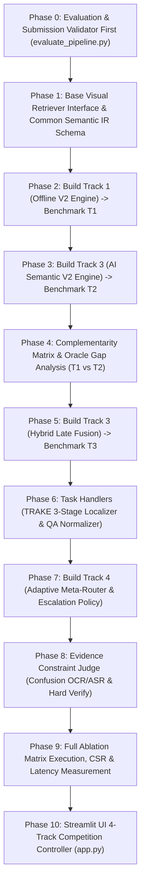

# Kế Hoạch Kiến Trúc Chuẩn Thi Đấu AIC 2026: 4-Track Adaptive Meta-Retrieval System (V3.0)

Bản đặc tả kiến trúc kỹ thuật này được thiết kế theo tư duy **Evaluation-First & Task-Centric**, tối ưu hóa trực tiếp cho cơ chế chấm điểm của **AIC 2026 (Known-Item Search, Visual Q&A, TRAKE)**, kết hợp giữa nghiên cứu khoa học hàn lâm (Ablation, Complementarity, Oracle Gap) và hệ thống kỹ thuật công nghiệp có độ trễ cực thấp.

---

## 1. Sơ Đồ Kiến Trúc Tổng Thể Hướng Tác Vụ (Task-Centric Architecture)

```
                                      USER QUERY / ĐỀ THI
                                               │
                                               ▼
                                      TASK ROUTER (AIC 2026)
                        ┌──────────────────────┼──────────────────────┐
                        │                      │                      │
                        ▼                      ▼                      ▼
                     TASK 1                 TASK 2                 TASK 3
                   KIS ENGINE             QA ENGINE             TRAKE ENGINE
               (Top-K Multimodal)     (Visual QA Norm)      (3-Stage Temporal)
                        │                      │                      │
                        └──────────────────────┼──────────────────────┘
                                               │
                                               ▼
                                  RETRIEVAL COMPILER CORE
                                               │
             ┌─────────────────────────────────┼─────────────────────────────────┐
             ▼                                 ▼                                 ▼
      ┌───────────────┐                 ┌───────────────┐                 ┌───────────────┐
      │    TRACK 1    │                 │    TRACK 2    │                 │    TRACK 3    │
      │  OFFLINE V2   │                 │  AI SEMANTIC  │                 │ HYBRID FUSION │
      │  (Zero-LLM)   │                 │ (LLM Compiler)│                 │ (Late Fusion) │
      └───────┬───────┘                 └───────┬───────┘                 └───────┬───────┘
              │                                 │                                 │
              ▼                                 ▼                                 ▼
          Kết quả R₁                        Kết quả R₂                        Kết quả R₃
              │                                 │                                 │
              └─────────────────────────────────┼─────────────────────────────────┘
                                                ▼
                                    ┌───────────────────────┐
                                    │        TRACK 4        │
                                    │ ADAPTIVE META-POLICY  │
                                    │    & ROUTER ENGINE    │
                                    └───────────┬───────────┘
                                                │
                        ┌───────────────────────┴───────────────────────┐
                        ▼                                               ▼
              [MODE A: WINNER ROUTING]                        [MODE B: ESCALATION]
             argmax P(Track i | Features)                    T1 (0.15s) -> T2 -> T3
                        │                                               │
                        └───────────────────────┬───────────────────────┘
                                                ▼
                                   4-STAGE PRECISION VERIFY
                                 ┌─────────────────────────────┐
                                 │ 1. Adaptive Union (100-500) │
                                 │ 2. Cheap Re-ranker (Top 50) │
                                 │ 3. Decoupled Composite DP   │
                                 │ 4. Constraint Graph Judge   │
                                 └──────────────┬──────────────┘
                                                │
                                                ▼
                                   OFFICIAL SUBMISSION EXPORT
                                    (CSV / ZIP Formatter)
```

---

## 2. Đặc Tả 4 Hướng Nghiên Cứu & Triển Khai (The 4 Tracks)

### 2.1. TRACK 1: Offline Engine V2 (Zero-LLM Precision-First)
- **Mục tiêu**: Độc lập 100% với LLM, độ trễ $< 0.15s$.
- **Cơ chế**:
  1. **Conservative Relation Classifier**: Phân loại 8 quan hệ (`TEMPORAL`, `SIMULTANEOUS`, `ATTRIBUTE`, `SPATIAL`, `CAUSAL`, `CONDITIONAL`, `COREFERENCE`, `UNKNOWN`). Nếu không chắc chắn $\implies$ gán `UNKNOWN` và fallback sang Global Retrieval (Ưu tiên Precision > Recall).
  2. **Adaptive Tiered Synonyms**: Mở rộng từ đồng nghĩa phân tầng (Tier A $w=1.0$, Tier B $w=0.7$, Tier C $w=0.3$). Chỉ kích hoạt Tier B/C khi độ bất định (Entropy) của kết quả sơ bộ cao.
  3. **Decoupled Composite DP**: $w_s = \alpha I_{\text{semantic}}(s) + \beta R_{\text{retrieval}}(s)$ kèm hàm phạt khoảng cách thời gian theo độ dài video ($\Delta t_{\text{norm}}$).

---

### 2.2. TRACK 2: AI Semantic Compiler V2 (Pure LLM Representation)
- **Mục tiêu**: Độc lập với quy tắc Offline để đo lường trần khả năng của LLM.
- **Cơ chế**:
  1. **6D Semantic Chunking Nullable**: `Global`, `Scene`, `Action`, `Object`, `Attributes`, `Relations`. Cấm LLM tự bịa bối cảnh nếu câu gốc không có (`scene: null`).
  2. **Provenance-Aware Source Grounding**: Phân biệt ranh giới rõ giữa `explicit` (từ gốc trong câu) và `inferred` (giả thuyết suy luận).
  3. **Bounded Multi-Hypothesis**: 1 Canonical Prompt + tối đa 2 Alternative Hypotheses (không bùng nổ Cartesian).

---

### 2.3. TRACK 3: Hybrid Fusion Engine (Late Retrieval Fusion)
- **Mục tiêu**: Nghiên cứu tính bổ sung giữa hai bộ compiler khi hoạt động song song.
- **Cơ chế**:
  1. **Late Retrieval Fusion (Rank-Level)**: Không gộp prompt sớm, chạy song song $Q_O \to R_O$ và $Q_A \to R_A$.
  2. **Confidence Calibration Layer**: Chuẩn hóa phân phối độ tin cậy của Offline và AI trước khi tính trọng số $w_O, w_A$.
  3. **Dual-Path Consensus Bonus**: Thưởng điểm cho ứng viên có sự đồng thuận cao giữa hai nhánh:
     $$A(d) = \exp\left(-\frac{|rank_O(d) - rank_A(d)|}{\tau}\right)$$

---

### 2.4. TRACK 4: Adaptive Meta-Policy & Intelligent Router Engine
> ⚠️ **Nguyên tắc cốt lõi**: Track 4 **KHÔNG PHẢI** là phép cộng $w_1 R_1 + w_2 R_2 + w_3 R_3$ (để tránh lỗi Double-Counting Evidence). Track 4 là **Bộ chính sách điều phối thông minh (Adaptive Decision Policy)**.

#### A. Trích xuất Vector đặc trưng siêu cấp (Meta-Features)
- **Đặc trưng câu hỏi**: Độ dài, số lượng thực thể, cờ chuỗi thời gian, độ mơ hồ ngữ nghĩa (Hypothesis Entropy).
- **Đặc trưng kết quả**: Rank Margin ($\text{Score}_{\text{top1}} - \text{Score}_{\text{top2}}$), Score Entropy $H(R_i)$, Retrieval Stability (độ ổn định khi đảo từ).
- **Đặc trưng bằng chứng**: OCR anchor confidence, ASR keyword signal.

#### B. Ba Chế Độ Điều Phối (3 Operating Modes)
1. **Mode A — Winner Selection**: Chọn Track tối ưu $\arg\max_i P(T_i \mid \mathbf{F}(q))$:
   - Query đơn giản / OCR rõ ràng $\implies$ Chọn **Track 1 (Offline)** (Phản hồi tức thì $0.05s$).
   - Query ngữ nghĩa trừu tượng $\implies$ Chọn **Track 2 (AI)**.
   - Query chuỗi hành động đa pha $\implies$ Chọn **Track 3 (Hybrid)**.
2. **Mode B — Escalation Policy (Tối ưu Latency đỉnh cao cho cuộc thi)**:
   - Thực thi nhanh Track 1 $\to$ Nếu $\text{Margin}(\text{Top1}, \text{Top2}) \ge \theta_{\text{safe}}$ & Entropy thấp $\implies$ **Trả kết quả ngay ($0.15s$)**.
   - Nếu không chắc chắn $\implies$ Leo thang sang Track 2.
   - Nếu xuất hiện mâu thuẫn chuỗi $\implies$ Leo thang sang Track 3.
   - *Kết quả*: Giảm độ trễ trung bình từ $1.4s \to 0.5s$ cho toàn bộ tập đề thi!
3. **Mode C — Selective Meta-Fusion**: Chỉ kết hợp khi các nhánh độc lập đạt độ tin cậy cao và có bằng chứng bổ sung.

---

## 3. Kiến Trúc Chuyên Biệt Cho Từng Tác Vụ AIC 2026

```
               ┌─────────────────────────────────────────────────────────┐
               │                 AIC 2026 TASK HANDLERS                  │
               └────────────────────────────┬────────────────────────────┘
                                            │
         ┌──────────────────────────────────┼──────────────────────────────────┐
         ▼                                  ▼                                  ▼
 ┌───────────────┐                  ┌───────────────┐                  ┌───────────────┐
 │  KIS HANDLER  │                  │  QA HANDLER   │                  │ TRAKE HANDLER │
 └───────┬───────┘                  └───────┬───────┘                  └───────┬───────┘
         │                                  │                                  │
 ┌───────┴──────────────┐           ┌───────┴──────────────┐           ┌───────┴──────────────┐
 │ • Visual 6D Recall   │           │ • Multimodal Evidence│           │ • Stage 1: Coarse Vid│
 │ • Temporal Monotonic │           │ • Answer Extraction  │           │ • Stage 2: Dense Samp│
 │ • Fuzzy OCR/ASR Match│           │ • Exact Normalization│           │ • Stage 3: Local Ref │
 └──────────────────────┘           └──────────────────────┘           └──────────────────────┘
```

1. **Known-Item Search (KIS)**: Tối ưu độ chính xác Top-K qua 4-Stage Precision Pipeline (Recall $\to$ Re-rank $\to$ Temporal DP $\to$ Constraint Judge).
2. **Visual Question Answering (QA)**: Trích xuất khung hình chứng cứ $\to$ Đưa vào Answer Extractor $\to$ **Chuẩn hóa đáp án (Answer Normalization)** (loại bỏ từ rác, đưa về dạng chuẩn như `blue`, `yes`, `2`).
3. **TRAKE (Temporal Action Keyframe Extraction)**:
   - **Stage 1**: Coarse Video-Level Retrieval (Top 20 video tiềm năng nhất).
   - **Stage 2**: Dense Frame Sampling trên các video ứng viên.
   - **Stage 3**: Local Temporal Refinement ($\pm 10s$ xung quanh khung hình cực đại) để tìm chính xác ranh giới sự kiện.

---

## 4. Phương Pháp Đánh Giá Thực Nghiệm & Phân Tích Bổ Sung (Complementarity & Oracle)

### 4.1. Ma Trận Bổ Sung (Complementarity Matrix)
Đo lường mức độ bù trừ giữa Track 1 và Track 2 trên tập dữ liệu kiểm thử:

| Trạng thái | AI Đúng ($T_2 = 1$) | AI Sai ($T_2 = 0$) |
| :--- | :---: | :---: |
| **Offline Đúng ($T_1 = 1$)** | Cả hai cùng đúng ($N_{11}$) | **Offline bù cho AI ($N_{10}$)** |
| **Offline Sai ($T_1 = 0$)** | **AI bù cho Offline ($N_{01}$)** | Cả hai cùng sai ($N_{00}$) |

$$\text{Tỷ lệ bổ sung tiềm năng} = \frac{N_{10} + N_{01}}{N_{\text{total}}}$$

### 4.2. Oracle Performance & Oracle Gap
$$\text{Oracle}@K = \frac{\text{Số query có ít nhất một Track ($T_1, T_2, T_3$) tìm đúng}}{\text{Tổng số query}}$$
$$\text{Oracle Gap} = \text{Oracle}@K - \max(\text{Recall}(T_1), \text{Recall}(T_2), \text{Recall}(T_3))$$
- Nếu $\text{Oracle Gap} > 8\% \implies$ Track 4 Meta-Router mang lại giá trị nhảy vọt vượt bậc.

### 4.3. Các Chỉ Số Đo Lường Riêng Cho Track 4
- **Routing Accuracy**: Tỷ lệ Meta-Router chọn đúng Track tốt nhất cho query.
- **Regret**: $\text{Oracle}@K - \text{Recall}_{\text{Track 4}}@K$.
- **Escalation Rate**: Tỷ lệ query phải gọi đến AI / Hybrid.
- **Latency Distribution**: p50 (Median) và p95 (Worst-case).
- **Constraint Satisfaction Rate (CSR)**: Tỷ lệ các ràng buộc ngữ nghĩa thực tế được thỏa mãn.

---

## 5. Lộ Trình Triển Khai 10 Giai Đoạn Chuẩn Nghiên Cứu



| Phase | Module / File | Nhiệm vụ kỹ thuật cụ thể |
| :--- | :--- | :--- |
| **Phase 0** | [evaluate_pipeline.py](file:///d:/AI%20challange/codeing/evaluate_pipeline.py) | Xây dựng bộ chấm điểm chuẩn AIC: KIS, QA, TRAKE evaluators + CSV/ZIP submission format validator. |
| **Phase 1** | [core/base_retriever.py](file:///d:/AI%20challange/codeing/core/base_retriever.py) | Định nghĩa `BaseVisualRetriever` abstraction (chuẩn bị mở rộng SigLIP) và `CommonSemanticIR` dataclass. |
| **Phase 2** | [core/query_compiler.py](file:///d:/AI%20challange/codeing/core/query_compiler.py) | Cài đặt Track 1: Relation Classifier (8 loại), Entity State, Tiered Synonyms (A: 1.0, B: 0.7, C: 0.3). |
| **Phase 3** | [core/ai_query_parser.py](file:///d:/AI%20challange/codeing/core/ai_query_parser.py) | Cài đặt Track 2: 6D Nullable Schema, Provenance Source Grounding, Bounded Hypotheses (Top 2-3). |
| **Phase 4** | [evaluate_pipeline.py](file:///d:/AI%20challange/codeing/evaluate_pipeline.py) | Đo Complementarity Matrix và Oracle Performance giữa Track 1 và Track 2. |
| **Phase 5** | [core/retrieval_engine.py](file:///d:/AI%20challange/codeing/core/retrieval_engine.py) | Cài đặt Track 3: Confidence Calibration Layer + Late Retrieval Fusion (R_O, R_A) + Consensus Bonus. |
| **Phase 6** | [core/retrieval_engine.py](file:///d:/AI%20challange/codeing/core/retrieval_engine.py) | Cài đặt Task-Specific Engines: TRAKE 3-Stage Temporal Refinement & QA Answer Normalizer. |
| **Phase 7** | [core/meta_router.py](file:///d:/AI%20challange/codeing/core/meta_router.py) | Cài đặt Track 4: Meta Feature Extractor, Winner Routing, và **Escalation Policy (0.15s -> 1.4s)**. |
| **Phase 8** | [core/evidence_engine.py](file:///d:/AI%20challange/codeing/core/evidence_engine.py) | Cài đặt Constraint Graph Evidence Judge + Confusion-Aware Fuzzy OCR/ASR ($0 \leftrightarrow O, 1 \leftrightarrow I$). |
| **Phase 9** | [evaluate_pipeline.py](file:///d:/AI%20challange/codeing/evaluate_pipeline.py) | Thực thi toàn bộ Ablation Matrix, đo R@1, R@5, MRR, CSR, p50/p95 Latency và Oracle Gap. |
| **Phase 10**| [app.py](file:///d:/AI%20challange/codeing/app.py) | Nâng cấp UI Streamlit: Bộ chọn 4-Track linh hoạt, hiển thị phân tích Meta-Router và chẩn đoán chuyên sâu. |

---

## 6. Ma Trận Đánh Giá Kết Quả Thực Nghiệm (Ablation Benchmark)

| Cấu hình | Mô tả kỹ thuật | R@1 | R@5 | MRR | CSR | Oracle Gap | Latency (p50 / p95) |
| :--- | :--- | :---: | :---: | :---: | :---: | :---: | :---: |
| **T1: Offline V2** | Zero-LLM + Relation Classifier + Tiered Synonyms | -- | -- | -- | -- | -- | ~0.08s / 0.15s |
| **T2: AI Semantic V2** | Pure LLM 6D Nullable + Bounded Hypotheses | -- | -- | -- | -- | -- | ~0.90s / 1.40s |
| **T3: Hybrid Fusion** | Calibrated Late Fusion (R_O + R_A) + Consensus | -- | -- | -- | -- | -- | ~0.95s / 1.50s |
| **T4: Meta-Policy** | Winner Selection & Escalation Policy + Evidence Judge | -- | -- | -- | -- | -- | **~0.25s / 1.10s** |
| **Oracle Ceiling** | Giới hạn trần lý tưởng (Ít nhất 1 Track đúng) | -- | -- | -- | -- | 0.0% | N/A |
